## Writeup Template
---

**Vehicle Detection Project**

The goals / steps of this project are the following:

* Perform a Histogram of Oriented Gradients (HOG) feature extraction on a labeled training set of images and train a classifier Linear SVM classifier
* Optionally, you can also apply a color transform and append binned color features, as well as histograms of color, to your HOG feature vector. 
* Note: for those first two steps don't forget to normalize your features and randomize a selection for training and testing.
* Implement a sliding-window technique and use your trained classifier to search for vehicles in images.
* Run your pipeline on a video stream (start with the test_video.mp4 and later implement on full project_video.mp4) and create a heat map of recurring detections frame by frame to reject outliers and follow detected vehicles.
* Estimate a bounding box for vehicles detected.

[//]: # (Image References)
[image1]: ./examples/car_not_car.png
[image2]: ./examples/HOG_example.jpg
[image3]: ./examples/sliding_windows.jpg
[image4]: ./examples/sliding_window.jpg
[image5]: ./examples/bboxes_and_heat.png
[image6]: ./examples/labels_map.png
[image7]: ./examples/output_bboxes.png
[video1]: ./project_video.mp4

## [Rubric](https://review.udacity.com/#!/rubrics/513/view) Points
### Here I will consider the rubric points individually and describe how I addressed each point in my implementation.  

---
### Writeup / README

#### 1. Provide a Writeup / README that includes all the rubric points and how you addressed each one.  

You're reading it!

### Histogram of Oriented Gradients (HOG)

#### 1. Explain how (and identify where in your code) you extracted HOG features from the training images.

The code for this step is contained in the model_save.py [model_save.py](./model_save.py) (line 42-48) where `extract_features()` function gives feature_list of bin_spatial,color_hist and hog_features.

Following steps are involved for extracting Hog features from training images:

a. I started by reading in all the `vehicle` and `non-vehicle` images.  Here is an example of one of each of the `vehicle` and `non-vehicle` classes:
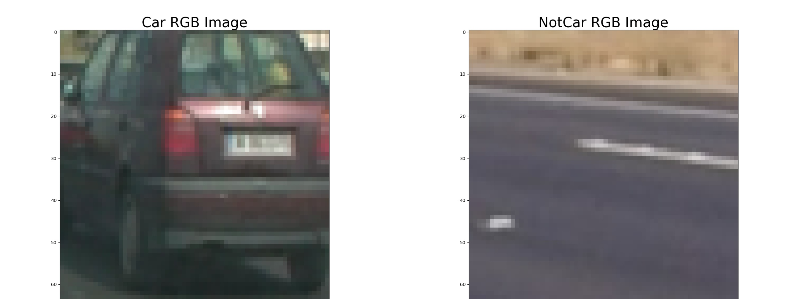

b. Then I converted the images into COLOR_RGB2YCrCb using ([functions.py](./functions.py))
```sh
`feature_image = cv2.cvtColor(image, cv2.COLOR_RGB2YCrCb)`
```
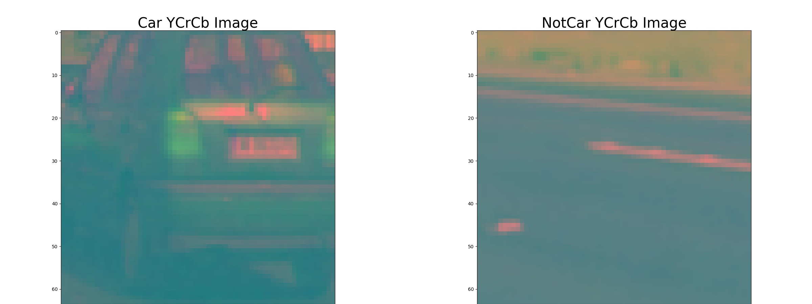

c. Then used `get_hog_features()` from [functions.py](./functions.py) to extract HOG features for all 3 channels.
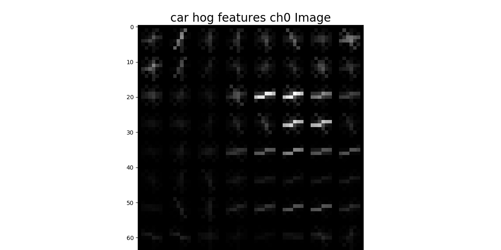
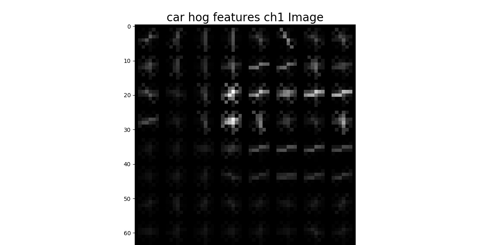
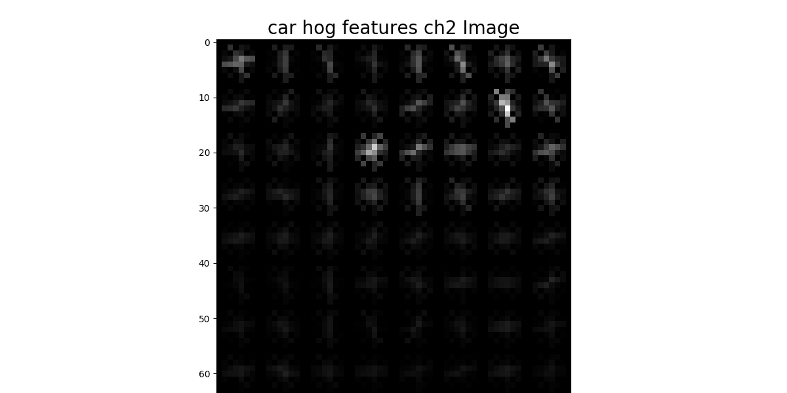
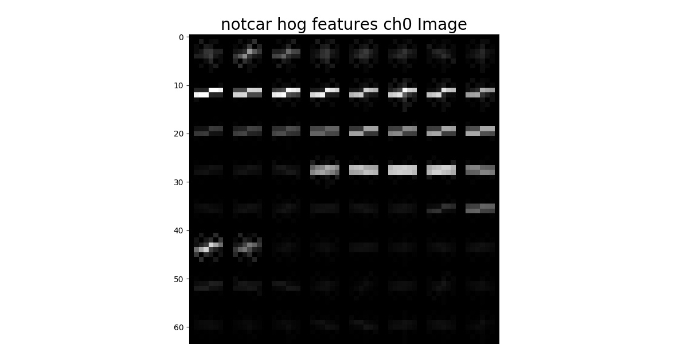
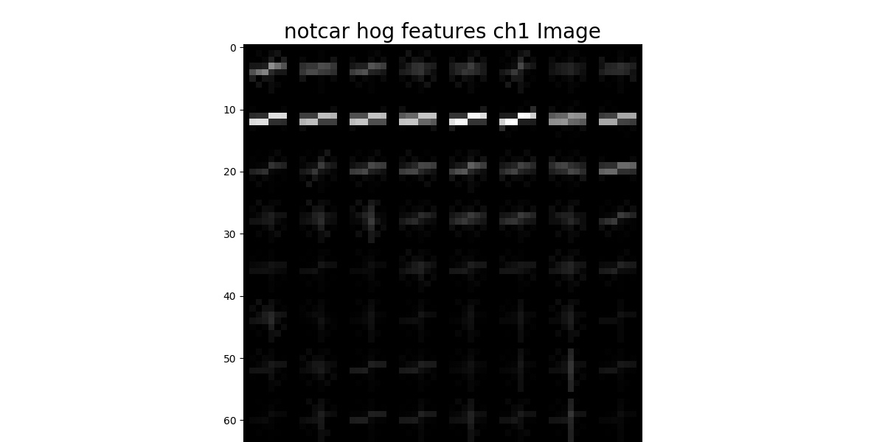
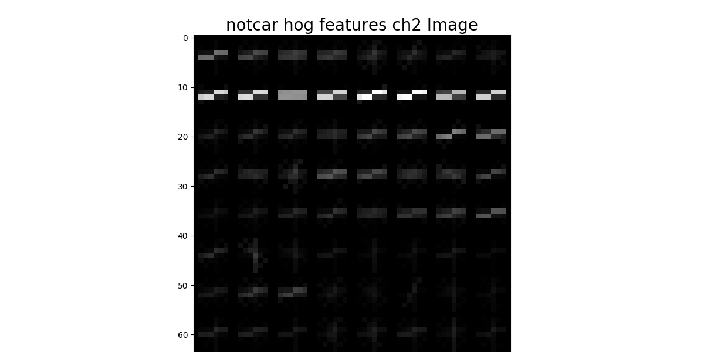
#### 2. Explain how you settled on your final choice of HOG parameters.

I tried various combinations of parameters and experimented the accuracy for color_space & orient.
Following are some results: [model_performance.py](./model_performance.py)

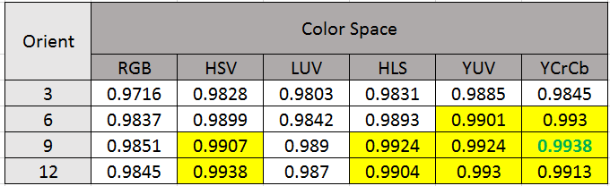
    

#### 3. Describe how (and identify where in your code) you trained a classifier using your selected HOG features (and color features if you used them).

I used linear SVM classifier for training. This phase involved following steps

a. Create datset:

   extract & ceate features list from traing set(i.e. car, notcar images). I used 3 features for car detection- bin_spatial, color_hist and hog_features.
   Function used: `extract_features()` defined in [functions.py](./functions.py)

b. Preprosessing the dataset
	
   The preprocessing module in scikit-learn provides a utility class StandardScaler that implements the Transformer API to compute the mean and standard deviation on a training set so as to be able to later reapply the same transformation on the testing set. 
   
   defined in [model_save.py](./model_save.py)
   ```sh
   X_scaler = StandardScaler().fit(X)
   scaled_X = X_scaler.transform(X)
   ```
c. Train the classifier
   
   After preprocessing we split the data into training set & validation set randomly. Then train the network on training set.
   ```
   rand_state = np.random.randint(0, 100)
   X_train, X_test, y_train, y_test = train_test_split(
        scaled_X, y, test_size=0.2, random_state=rand_state)
    svc = LinearSVC()
    svc.fit(X_train, y_train)
   ```
d. Validate the classifier

   Once training is over, we validate the trained model on validation set
   ```
   print('Test Accuracy of SVC = ', round(svc.score(X_test, y_test), 4))
   ```
### Sliding Window Search

#### 1. Describe how (and identify where in your code) you implemented a sliding window search.  How did you decide what scales to search and how much to overlap windows?

For better performance, instead of searching objects in entire image, I restricted the search from middle to lower bottom region(as mention in next section).
		
		img_tosearch = img[ystart:ystop,:,:]

For sliding window, I used Hog Sub-sampling Window Search method mentioned in the class one that allows us to only have to extract the Hog features once. 
The code below defines a single function `find_cars()` that's able to both extract features and make predictions.

The find_cars only has to extract hog features once and then can be sub-sampled to get all of its overlaying windows. 
Each window is defined by a scaling factor where a scale of 1 would result in a window that's 8 x 8 cells then the overlap of each window is in terms of the cell distance. 
This means that a cells_per_step = 2 would result in a search window overlap of 75%.

#### 2. Show some examples of test images to demonstrate how your pipeline is working.  What did you do to optimize the performance of your classifier?

I choose to use bin_spatial, color_hist and hog_features features on YCrCb 3-channel based on experimental results.
Which gave nice results. To improve the performace, I limited my search window in y-axis direction

    ystart = 350    # Min in y to search
    ystop = 656     # Max in y to search

Following are some result on different test images with histogram

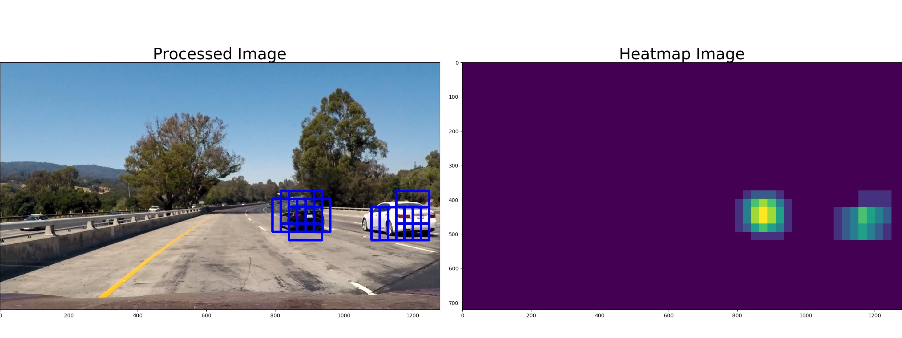
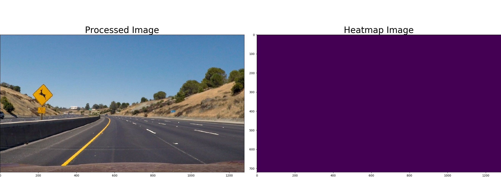
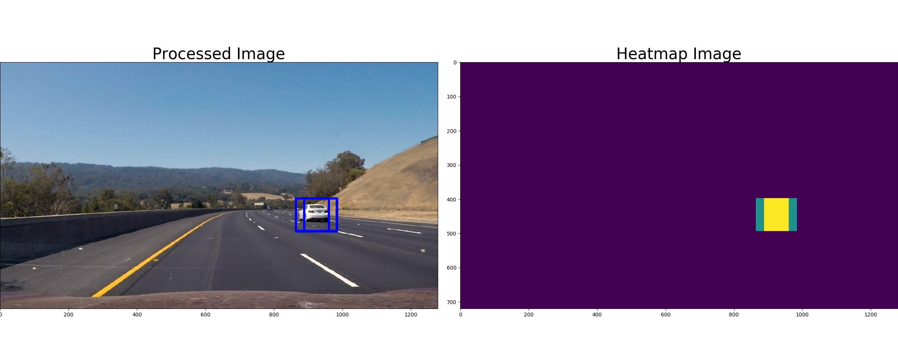
---

### Video Implementation

#### 1. Provide a link to your final video output.  Your pipeline should perform reasonably well on the entire project video (somewhat wobbly or unstable bounding boxes are ok as long as you are identifying the vehicles most of the time with minimal false positives.)
Here's a [link to my video result](./project_video_output.mp4)

 
#### 2. Describe how (and identify where in your code) you implemented some kind of filter for false positives and some method for combining overlapping bounding boxes.

I recorded the positions of positive detections in each frame of the video.  From the positive detections I created a heatmap and then thresholded that map to identify vehicle positions.  I then used `scipy.ndimage.measurements.label()` to identify individual blobs in the heatmap.  I then assumed each blob corresponded to a vehicle.  I constructed bounding boxes to cover the area of each blob detected.  
 code: `process_frame()` function under [run.py](./run.py) 
 
	out_img, heatmap = find_cars(img, ystart, ystop, scale, clf, scaler, orient, pix_per_cell, cell_per_block, spatial_size, hist_bins)
    show_two_img(out_img, heatmap, "Processed", "Heatmap", "test1result")
    heatmap = apply_threshold(heatmap,1)
    #show_single_img(heatmap, "Heatmap after threshold-2", "heatmap_after_threshold_2")
    labels = label(heatmap) 

Here's an example result showing how rightly choosing heatmap threshold helped to removed false poitives

##### Here is test frames and their corresponding heatmaps, and result with different heatmap threshold:
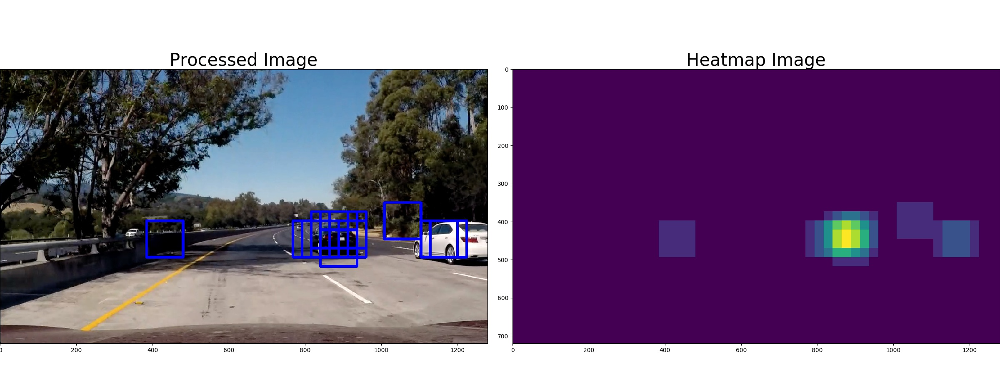
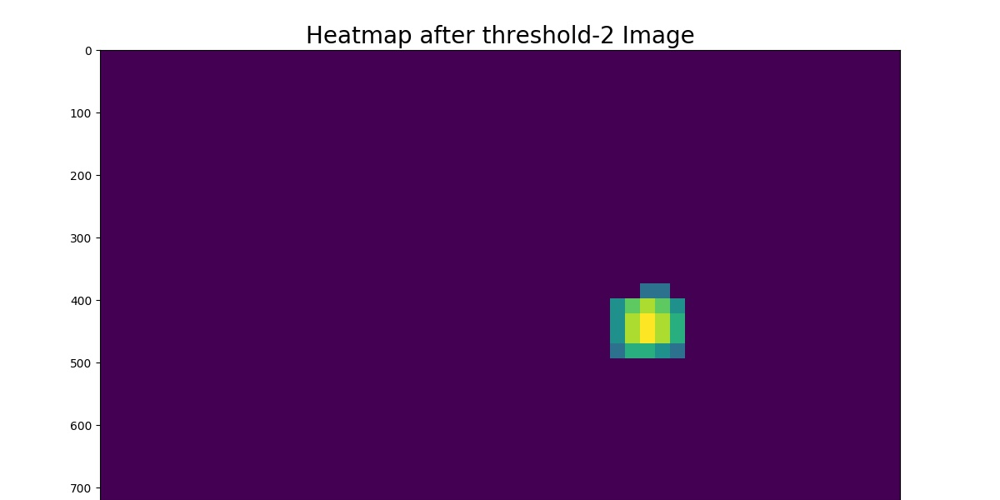
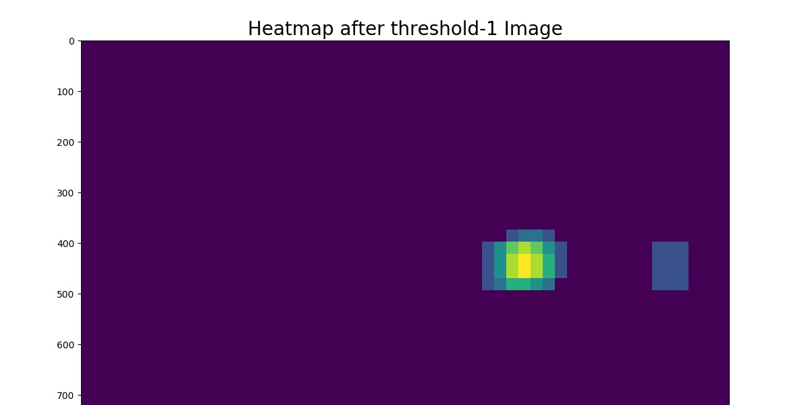


##### Here the resulting bounding boxes are drawn onto the test frame:
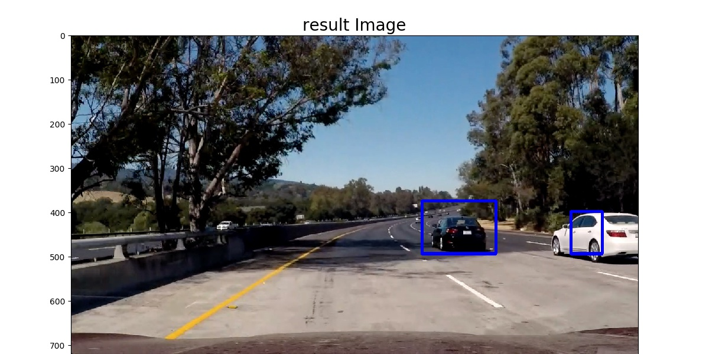

---

### Discussion

#### 1. Briefly discuss any problems / issues you faced in your implementation of this project.  Where will your pipeline likely fail?  What could you do to make it more robust?

I faced below problems:

a. Understanding & selecting which paramters to use for training:
   For this problem, i experimented the accuracy over different color channels & orient.

b. Removing false positive: Initially there was lots of false positives which I reduced by experimenting with hog thresholds

Still there are false positives in shadow, dark region of trees areas. Also tracker does't look smooth and not work well when two detected objects are close. 
Which I think can be addressed by adding more features & tracking the detected vehicles over few frames.
